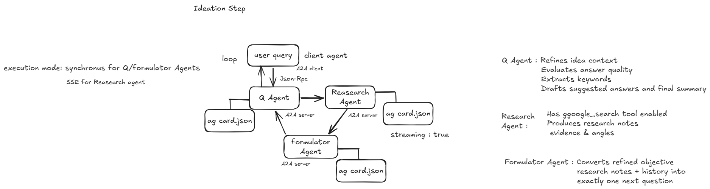

# Startwise

AI-powered startup ideation platform that turns a rough idea into a structured strategy through an interactive multi-agent Q/A workflow.

## Overview

Startwise guides founders from idea to clarity by combining:

- A modern frontend experience (`Next.js` + `TypeScript`)
- A Django API backend for session/state orchestration
- Multi-agent reasoning with Google ADK + A2A
- OpenAI-powered iterative questioning and refinement with Firecrawl-backed research

The core flow is sequential and adaptive: each next question is generated based on the previous user answer.

## Architecture



## Tech Stack

- Frontend: `Next.js`, `React`, `TypeScript`, `Tailwind`, `shadcn/ui`
- Backend: `Django`, `Python`
- Agent Runtime: `google-adk`, `a2a-sdk`, `uvicorn`
- LLM Provider: `OpenRouter` via LiteLLM (`meta-llama/llama-3.3-70b-instruct:free`)

## Repository Structure

```text
Startwise/
├─ frontend/                 # Next.js application
├─ backend/                  # Django + ADK/A2A agent services
│  ├─ ideation/
│  │  ├─ agents/             # Question / Research / Formulator agents
│  │  └─ services/           # A2A client + orchestration logic
│  └─ manage.py
└─ README.md
```

## Core Agent Flow

1. User submits business idea in frontend.
2. Django initializes ideation session.
3. `QuestionAgent` refines context (sync).
4. `ResearchAgent` produces strategic notes (streaming/SSE mode).
5. `FormulatorAgent` generates one next question.
6. User answers, and answer quality is evaluated.
7. Loop continues until completion criteria is met, then summary is generated.

## Quick Start

### 1. Backend setup

From `backend/`:

```bash
uv pip install -r requirements.txt
```

Create env:

```bash
cp .env.example .env
```

Required env values:

- `OPENROUTER_API_KEY=<your_openrouter_api_key>`
- `QUESTION_AGENT_MODEL=meta-llama/llama-3.3-70b-instruct:free`
- `RESEARCH_AGENT_MODEL=meta-llama/llama-3.3-70b-instruct:free`
- `FORMULATOR_AGENT_MODEL=meta-llama/llama-3.3-70b-instruct:free`

### 2. Run backend services

From `backend/`, in separate terminals:

```bash
uv run python -m ideation.agents.question_agent
uv run python -m ideation.agents.research_agent
uv run python -m ideation.agents.formulator_agent
uv run python manage.py runserver 0.0.0.0:8001
```

### 3. Frontend setup

From `frontend/`:

```bash
npm install
npm run dev
```

Set frontend env:

- `NEXT_PUBLIC_BACKEND_URL=http://localhost:8001`

## API (Ideation)

Main endpoints:

- `GET /health`
- `POST /init`
- `POST /respond`
- `GET /keywords/<session_id>/<question_index>`
- `POST /suggest`
- `GET /session/<session_id>`
- `DELETE /session/<session_id>`
- `GET /summary/<session_id>`
- `POST /summary-with-image/<session_id>`
- `POST /reset`

## Notes

- If agent services are unavailable, set `USE_A2A_MOCK=true` in `backend/.env` for local fallback.
- The A2A architecture is unchanged. The text agents now run through ADK's LiteLLM connector against OpenRouter instead of Gemini.
- For full backend details, see [`backend/README.md`](backend/README.md).
